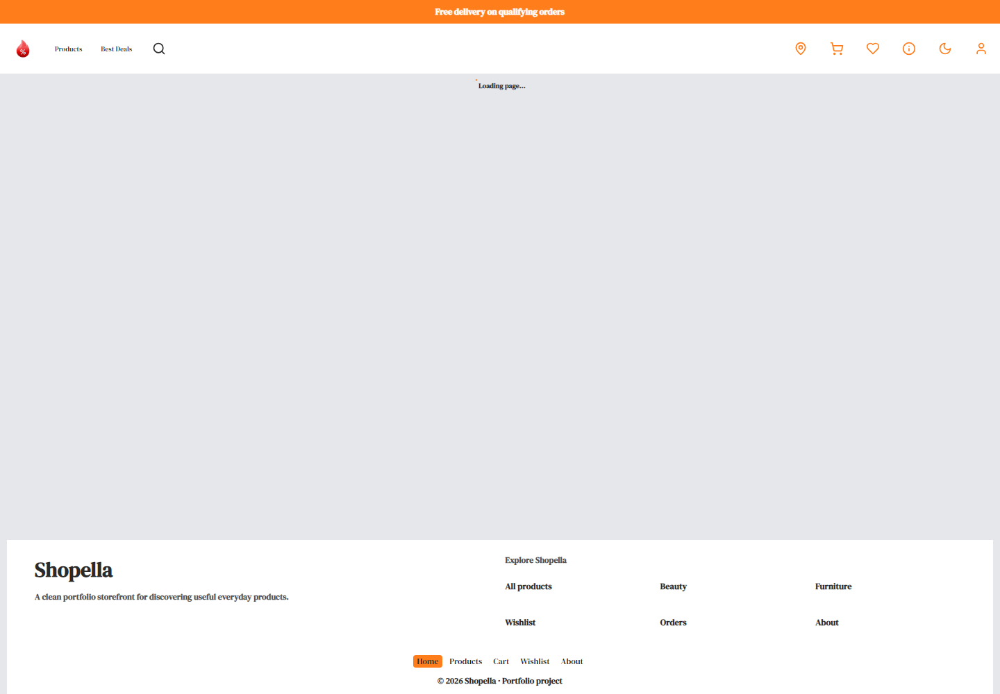
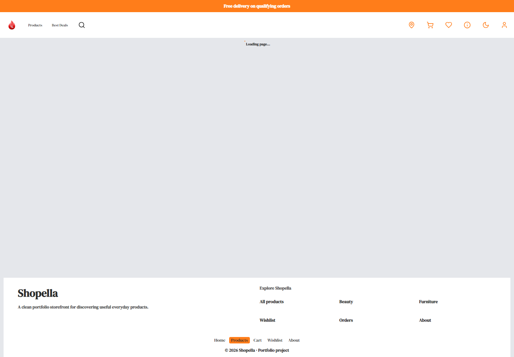

# Shopella

Shopella is a portfolio storefront built with React 19 and TypeScript. It keeps the original Vite application as the fast development reference while Next.js App Router is the production target. It demonstrates a complete shopping journey: catalogue browsing, URL filters, product details, wishlist, cart, checkout, orders, and a streamed AI shopping assistant.

**Live demo:** `https://your-shopella-project.vercel.app` *(replace after deployment)*





## Main features

- Responsive home, catalogue, product gallery, cart, checkout, account, and orders pages
- DummyJSON catalogue data with React Query caching, retries, and abort signals
- Frontend-only admin demo with local product CRUD, inventory adjustments, image previews, validation, and audit history
- Admin workflows are simulated; persistent catalogue storage and server-side authorization are outside this portfolio project's scope
- Browser-local demo login and demo orders that work without a server or Supabase
- Optional Supabase authentication and order persistence
- Protected checkout, account, order history, and confirmation routes
- Streamed Groq shopping advice using AI SDK v6 and official AI Elements
- Five assistant requests per minute using a hashed client fingerprint
- Keyboard dialogs, focus trapping, skip navigation, reduced motion, and WCAG checks
- Lazy route and AI bundles, lazy below-the-fold images, skeletons, and stable media space

## Architecture

```text
Shared React UI
├─ Redux Toolkit: cart, wishlist, safe mirrored user
├─ React Query: products, order reads, order mutations
└─ Vite development reference and Next.js App Router production target
        │
        ▼
Next.js API routes
├─ /api/orders ── demo orders or optional Supabase persistence
└─ /api/assistant ── streamed shopping advice
```

Use Vite for day-to-day UI and CSS work. Use Next.js to test App Router, API routes, and the production build. The archived Express server remains unchanged as project history and is not part of the active app.

## Project structure

- `src/app` — shared Redux store, React Query client, and theme wiring
- `src/vite` — Vite entry point, React Router routes, pages, authentication wrapper, and layout shell
- `src/layouts/next` — Next.js layout shell, navigation, footer, drawers, and assistant loader
- `src/features` — shared feature UI and business logic, with `next` folders only for App Router pages or Next-optimized image/navigation variants
- `src/components/ui` — reusable loading, dialog-focus, toast, and assistant UI
- `src/components/ai-elements` — official streamed conversation and message components
- `src/styles` — purpose-specific CSS/BEM files and shared theme tokens
- `api` — Vite/Vercel API adapter and shared server modules
- `app/api` — Next.js order and assistant API routes
- `supabase/migrations` — orders, rate-limit storage, indexes, checks, and RLS
- `e2e` — authenticated checkout, keyboard, and automated accessibility tests
- `archive` — inactive historical Express backend

## Local setup

Requirements: Node.js 20+ and npm. Supabase and Groq configuration are optional for their respective live integrations; demo login and demo orders work without them.

```bash
npm install
npm run vite:dev
```

For Next.js development and production checks:

```bash
npm run dev
```

Optional live integrations use `.env.local`:

```env
VITE_SUPABASE_URL=your_project_url
VITE_SUPABASE_PUBLISHABLE_KEY=your_publishable_key
SUPABASE_SECRET_KEY=your_server_secret_key
GROQ_API_KEY=your_groq_key
```

Keep Supabase secrets and the Groq key only in local/Vercel server environment settings. Never commit `.env.local`.

## Optional Supabase setup

1. Create a Supabase project.
2. Run [`supabase/migrations/202607190001_shopella_orders.sql`](./supabase/migrations/202607190001_shopella_orders.sql) in the Supabase SQL editor or with the Supabase CLI.
3. For this portfolio flow, disable email confirmation so registration can sign in immediately.
4. Add the browser and server environment values shown above.

The browser cannot read or write the `orders` table directly. When configured, the server verifies the access token and uses the server secret for scoped reads and writes.

## API contracts

### `GET /api/orders`

Requires `Authorization: Bearer <Supabase access token>` and returns only the authenticated user's orders.

### `POST /api/orders`

Requires the same token and accepts:

```json
{
  "items": [{ "id": 1, "quantity": 2 }],
  "customer": { "name": "Jane Doe", "address": "123 Main Street" }
}
```

The server fetches canonical product information before checking stock and calculating totals. Browser-supplied titles, prices, discounts, stock, and email are not trusted.

### `POST /api/assistant`

Accepts AI SDK `UIMessage[]` and returns a streamed UI message response. It uses the latest 10 messages, limits each text message to 800 characters, caps output, and provides catalogue-grounded advice only. It cannot add products, place orders, or complete purchases.

## Commands

```bash
npm run vite:dev  # original Vite development app
npm run dev       # Next.js development server
npm run typecheck # TypeScript check
npm run lint      # ESLint
npm test          # Vitest unit/component tests with coverage
npm run test:e2e  # Playwright checkout and accessibility flows
npm run vite:build # Vite production build
npm run build      # Next.js production build
npm run start      # start the built Next.js production app
npm run vite:preview # preview the Vite production build
```

Playwright needs a browser once per machine:

```bash
npx playwright install chromium
```

## AI-assisted development disclosure

This project was upgraded with AI assistance for architecture review, code generation, validation rules, tests, accessibility checks, and documentation. The developer selected the scope, reviewed the code, provided the product direction, and remains responsible for understanding, testing, and maintaining the result. This is meant to demonstrate responsible AI-assisted development—not to claim that every line was written manually.

## Honest project boundaries

- Product names, images, prices, and stock come from DummyJSON and are demonstration data.
- Checkout confirms a portfolio order; there is no payment processor or real fulfilment.
- Email confirmation is intentionally disabled for immediate portfolio registration.
- AI advice may be incomplete or imperfect and should not be treated as professional advice.
- Supabase persistence is optional; without it, demo login and orders stay browser-local.
- A custom domain, newsletter provider, and separate active Express server are outside this project.

